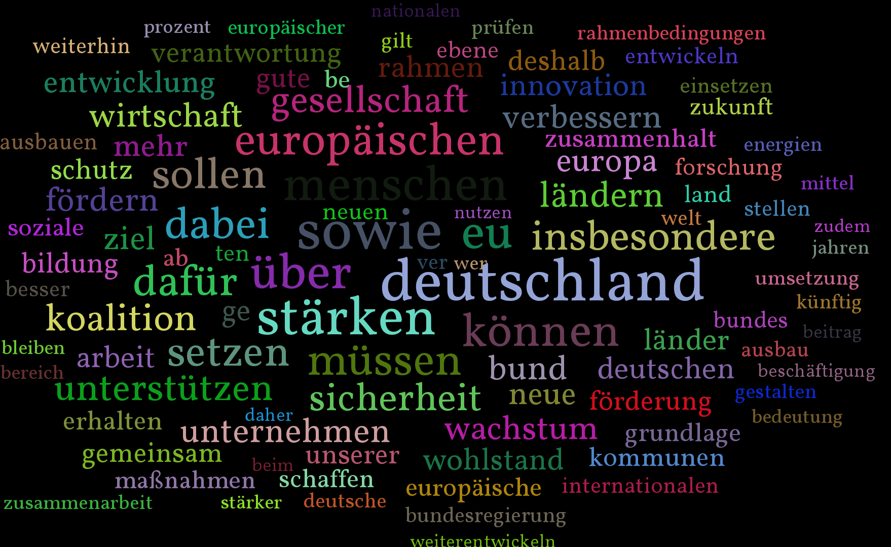

pdf2tagcloud
============

Generate tagclouds from pdf documents to get a quick gist of their content.

Usage: 

python makeCloudFromPdf -f filename.pdf

Requires [PyPDF2](https://github.com/mstamy2/PyPDF2) and [PyTagCloud](https://github.com/atizo/PyTagCloud)

An example file is provided in kv.pdf, it's the coalition contract of the german government in the year 2013. It's visualization looks like this:

